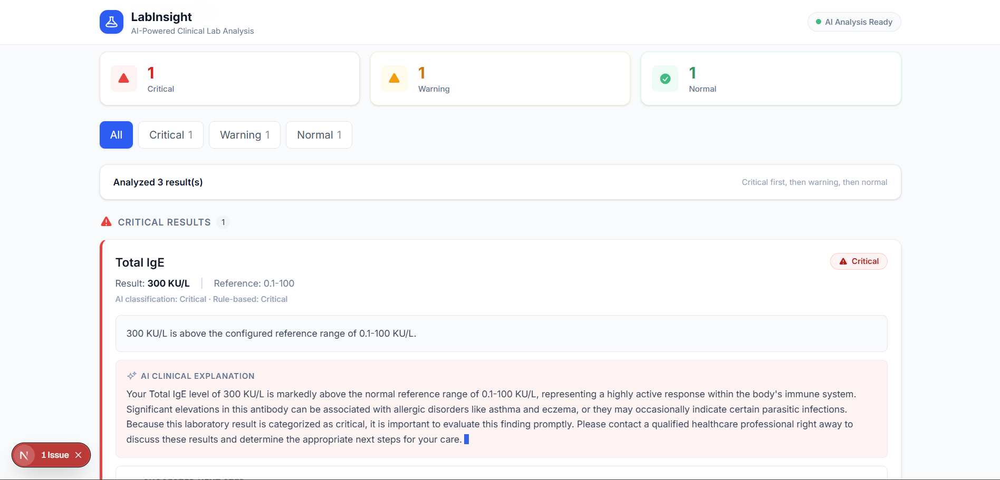
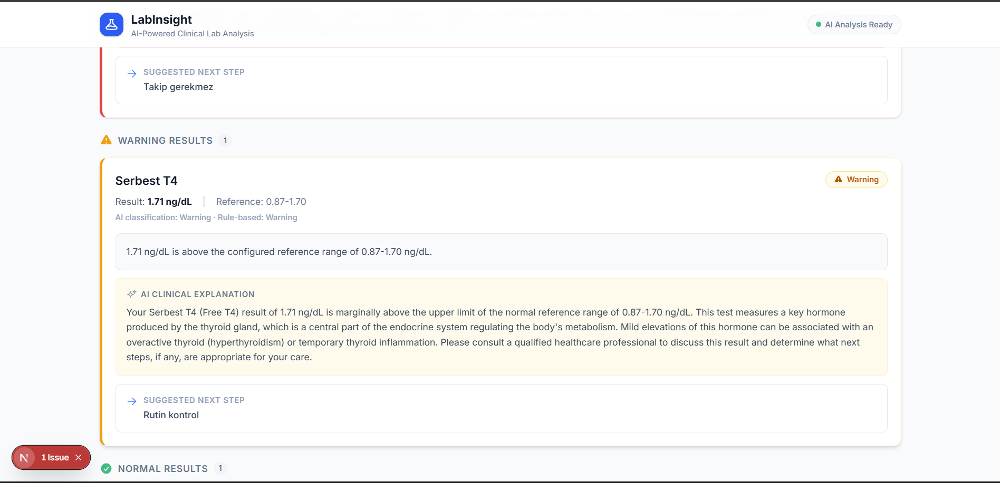
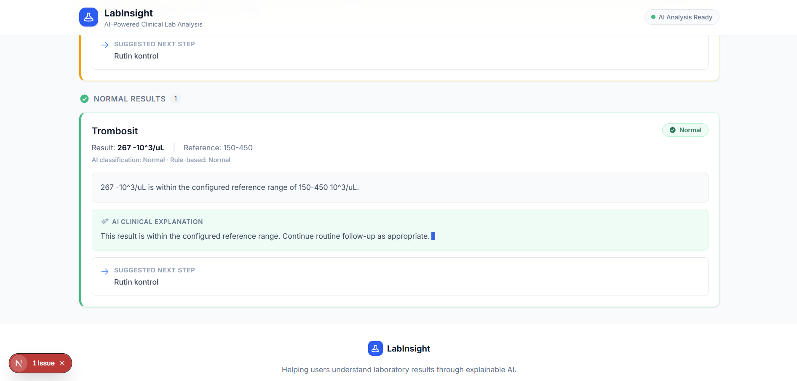
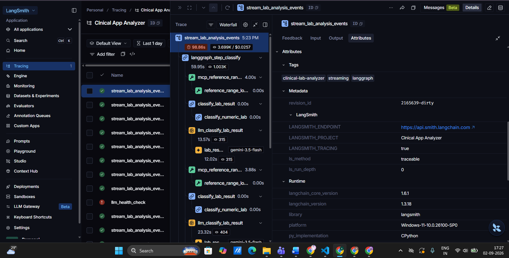

# 🧪 LabInsight

> **AI-Powered Clinical Laboratory Results Analyzer**

LabInsight is a full-stack AI-powered application designed to analyze laboratory test results, classify them as **Normal, Warning, or Critical**, provide **AI-generated clinical explanations**, and suggest appropriate next steps.

The application follows an **Explainable AI** approach, helping users understand not only whether a laboratory result has been flagged, but also **why it was flagged and what it may indicate**.

---

## 📸 Application Preview

### 1. Lab Input

<p align="center">
  
</p>

Users can provide laboratory test results through the LabInsight interface and submit them for AI-powered analysis.

---

### 2. AI Analysis Results

<p align="center">
  
</p>

The results dashboard displays laboratory findings with clear **Normal, Warning, and Critical** severity classifications.

---

<!-- ### 3. Explainable AI Output -->

<p align="center">
  
</p>

<p align="center">
  
</p>

LabInsight provides AI-generated explanations for laboratory results along with suggested next steps.

---

### 4. LangSmith Observability

<p align="center">
  
</p>

LangSmith provides visibility into the AI workflow, including execution traces, LLM calls, latency, and overall pipeline performance.

---

# ✨ Features

* 🧪 Laboratory test result analysis
* 📄 CSV upload support
* 🤖 AI-powered clinical explanations
* 🟢 Normal / 🟡 Warning / 🔴 Critical classification
* 🚨 Severity-based result routing
* 🧠 Explainable AI
* 💡 AI-generated explanations for abnormal results
* 📋 Suggested next steps
* 🔌 MCP server for agent/tool communication
* 🔗 LangChain for LLM integration
* 📊 LangGraph for AI workflow orchestration
* 🔍 LangSmith for tracing and observability
* 💎 Google Gemini for Generative AI
* ⚡ FastAPI backend
* ⚛️ React frontend
* 📱 Responsive user interface
* ❌ Error handling for invalid or incomplete data

---

# 🎯 Problem Statement

Clinical laboratories generate large amounts of laboratory test results every day. Healthcare providers need to quickly identify abnormal values, understand their potential clinical significance, and determine appropriate next steps.

LabInsight addresses this problem by providing an AI-assisted interface that:

1. Accepts laboratory test results.
2. Classifies results based on severity.
3. Routes results by severity.
4. Generates understandable AI explanations.
5. Provides suggested next steps.
6. Presents the information through a clear and user-friendly dashboard.

---

# 🧠 Explainable AI

A core principle of LabInsight is **Explainable AI**.

Instead of simply displaying:

```text
Hemoglobin → Critical
```

LabInsight provides additional context:

```text
Test: Hemoglobin

Result: 8.2 g/dL

Status: Critical

AI Clinical Explanation:
[AI-generated explanation]

Suggested Next Step:
[AI-generated next step]
```

This allows users to understand:

* What the result represents
* Why it was classified as Normal, Warning, or Critical
* What the abnormality may indicate
* What next step may be appropriate

The AI-generated explanation is displayed alongside the laboratory result to make the analysis more transparent and understandable.

---

# 🏗️ System Architecture

LabInsight combines a React frontend, FastAPI backend, MCP server, LangGraph workflow, LangChain, Google Gemini, and LangSmith.

```text
┌─────────────────────────────────────┐
│             LabInsight              │
│              React UI               │
│                                     │
│   Lab Input / CSV Upload / Results  │
└──────────────────┬──────────────────┘
                   │
                   │ HTTP
                   ▼
┌─────────────────────────────────────┐
│          FastAPI Backend            │
│                                     │
│         POST /analyze_labs          │
└──────────────────┬──────────────────┘
                   │
                   ▼
┌─────────────────────────────────────┐
│             MCP Server              │
│                                     │
│       Agent / Tool Communication    │
└──────────────────┬──────────────────┘
                   │
                   ▼
┌─────────────────────────────────────┐
│             LangGraph               │
│                                     │
│       Classify → Route → Explain    │
└──────────────────┬──────────────────┘
                   │
                   ▼
┌─────────────────────────────────────┐
│             LangChain               │
│                                     │
│          LLM Integration            │
└──────────────────┬──────────────────┘
                   │
                   ▼
┌─────────────────────────────────────┐
│          Google Gemini              │
│                                     │
│      AI-generated Explanation       │
└─────────────────────────────────────┘
                   │
                   ▼
        ┌─────────────────────┐
        │      LangSmith      │
        │                     │
        │ Tracing & Monitoring│
        └─────────────────────┘
```

---

# 🔄 AI Workflow

The core LabInsight analysis workflow follows:

```text
Laboratory Input
       │
       ▼
Validate Data
       │
       ▼
Classify Result
       │
       ▼
Route by Severity
       │
       ├───────────────┐
       │               │
       ▼               ▼
    Normal          Abnormal
                       │
                       ▼
                Warning / Critical
                       │
                       ▼
               Generate AI Explanation
                       │
                       ▼
                Suggested Next Step
                       │
                       ▼
                Structured Response
                       │
                       ▼
                 React Dashboard
```

The workflow is orchestrated using **LangGraph**, with **LangChain** handling the LLM integration and **Google Gemini** generating AI-powered explanations.

---

# 🧩 Technology Stack

| Technology        | Purpose                               |
| ----------------- | ------------------------------------- |
| **React**         | Frontend user interface               |
| **FastAPI**       | Backend REST API                      |
| **Python**        | Backend and AI application logic      |
| **Google Gemini** | Generative AI / clinical explanations |
| **LangChain**     | LLM integration and prompt handling   |
| **LangGraph**     | AI workflow orchestration             |
| **MCP Server**    | Agent and tool communication          |
| **LangSmith**     | AI tracing and observability          |
| **CSV**           | Laboratory test data                  |
| **Git & GitHub**  | Version control                       |

---

# 🤖 Google Gemini

LabInsight uses **Google Gemini** as the primary Generative AI model.

Gemini is used to generate understandable explanations for laboratory results and provide suggested next steps based on the analysis.

The application uses structured laboratory information as input to the AI workflow and presents the generated explanation through the React dashboard.

---

# 🔗 LangChain

**LangChain** is used as the LLM integration layer within LabInsight.

It is responsible for components such as:

* Connecting the application with Gemini
* Managing prompts
* Structuring LLM interactions
* Supporting the AI workflow
* Handling AI-related application logic

---

# 📊 LangGraph

**LangGraph** is used to orchestrate the analysis workflow.

The primary workflow follows:

```text
Classify
   ↓
Route
   ↓
Explain
```

This graph-based architecture keeps the AI workflow modular and makes it easier to monitor, debug, and extend.

---

# 🔌 MCP Server

LabInsight uses an **MCP server** for structured agent and tool communication.

The MCP layer provides a standardized interface between the AI workflow and available tools.

This architecture also provides a foundation for extending LabInsight with additional tools such as reference-range lookup.

---

# 🔍 LangSmith

**LangSmith** is used for AI observability and tracing.

It provides visibility into the execution of the AI pipeline, including:

* LLM calls
* Agent execution
* LangGraph execution
* Prompts
* AI responses
* Execution traces
* Latency
* Workflow performance

The LangSmith dashboard helps monitor how requests move through the AI workflow and makes it easier to identify performance or execution issues.

### Example Observability Flow

```text
User Request
     ↓
LangGraph
     ↓
LangChain
     ↓
Gemini
     ↓
AI Response
     ↓
Final Result
```

LangSmith captures the relevant execution information for monitoring and debugging.

---

# 🖥️ Frontend

The frontend is developed using **React**.

The frontend provides:

* Laboratory result input
* CSV upload
* Analysis trigger
* Loading states
* Error states
* Severity badges
* Result cards
* AI explanations
* Suggested next steps

### React Structure

```text
frontend/
└── src/
    ├── components/
    │   ├── LabInput.jsx
    │   ├── ResultsDisplay.jsx
    │   └── SeverityBadge.jsx
    │
    ├── App.jsx
    ├── main.jsx
    └── ...
```

---

# ⚡ Backend

The backend is built using **Python FastAPI**.

## Main API Endpoint

```http
POST /analyze_labs
```

The endpoint accepts laboratory test data and returns structured analysis results.

The response contains information such as:

* Laboratory test
* Test value
* Unit
* Classification
* Severity
* AI explanation
* Suggested next step

---

# 🚦 Severity Classification

LabInsight classifies laboratory results into three severity levels.

| Status          | Description                         |
| --------------- | ----------------------------------- |
| 🟢 **Normal**   | Result is within the expected range |
| 🟡 **Warning**  | Result requires attention           |
| 🔴 **Critical** | Result requires immediate attention |

Results are routed and displayed according to severity, with critical results prioritized over warnings and normal results.

---

# 📄 CSV Upload

LabInsight supports laboratory data through CSV input.

The workflow is:

```text
CSV File
   ↓
Upload
   ↓
Validate Laboratory Data
   ↓
Analyze
   ↓
Classify
   ↓
Route
   ↓
Explain
   ↓
Display Results
```

---

# 📁 Test Data

The project contains synthetic test datasets in:

```text
/test_data
```

Example:

```text
test_data/
├── normal_results.csv
├── warning_results.csv
└── critical_results.csv
```

These datasets cover the primary classification scenarios:

* Normal laboratory results
* Warning laboratory results
* Critical laboratory results

---

# 🚀 Getting Started

## Prerequisites

Make sure the following are installed:

* Python 3.x
* Node.js
* npm
* Git

You will also need the required API credentials for Gemini and LangSmith.

---

# ⚙️ Backend Setup

Navigate to the backend directory:

```bash
cd backend
```

Create a Python virtual environment:

```bash
python -m venv venv
```

### Windows

```bash
venv\Scripts\activate
```

### macOS / Linux

```bash
source venv/bin/activate
```

Install Python dependencies:

```bash
pip install -r requirements.txt
```

Create a `.env` file in the backend directory.

Example:

```env
GEMINI_API_KEY=Your Gemini API Key
GEMINI_MODEL=gemini-3.5-flash
LANGSMITH_TRACING=true
LANGSMITH_ENDPOINT=https://api.smith.langchain.com
LANGSMITH_API_KEY=Your langsmith API Key
LANGSMITH_PROJECT=Project Name that you want to place
```

Add any additional environment variables required by the MCP server or your existing project configuration.

Start the FastAPI server:

```bash
uvicorn main:app --reload
```

---

# ⚛️ Frontend Setup

Navigate to the frontend directory:

```bash
cd frontend
```

Install dependencies:

```bash
npm install
```

Start the development server:

```bash
npm run dev
```

Open the local URL displayed by Vite in your browser.

---

# 🧪 How to Test

## 1. Start the Backend

```bash
cd backend
uvicorn main:app --reload
```

## 2. Start the Frontend

```bash
cd frontend
npm run dev
```

## 3. Upload Test Data

Use one of the datasets from:

```text
/test_data
```

For example:

```text
normal_results.csv
```

## 4. Run Analysis

Submit the laboratory data through the LabInsight interface.

## 5. Verify the Results

Confirm that the application:

* Accepts the laboratory data
* Sends the request to `/analyze_labs`
* Processes the laboratory results
* Classifies the results
* Routes results by severity
* Generates AI explanations
* Displays suggested next steps
* Displays the final results in the React dashboard

---

# 🧪 Test Scenarios

### 🟢 Normal Results

Use:

```text
/test_data/normal_results.csv
```

Expected classification:

```text
🟢 Normal
```

---

### 🟡 Warning Results

Use:

```text
/test_data/warning_results.csv
```

Expected classification:

```text
🟡 Warning
```

---

### 🔴 Critical Results

Use:

```text
/test_data/critical_results.csv
```

Expected classification:

```text
🔴 Critical
```

---

# 📂 Project Structure

```text
LabInsight/
│
├── backend/
│   ├── main.py
│   ├── agent/
│   ├── mcp/
│   ├── services/
│   ├── requirements.txt
│   └── ...
│
├── frontend/
│   ├── src/
│   │   ├── components/
│   │   │   ├── LabInput.jsx
│   │   │   ├── ResultsDisplay.jsx
│   │   │   └── SeverityBadge.jsx
│   │   │
│   │   ├── App.jsx
│   │   └── main.jsx
│   │
│   ├── package.json
│   └── ...
│
├── test_data/
│   ├── normal_results.csv
│   ├── warning_results.csv
│   └── critical_results.csv
│
├── screenshots/
│   ├── input.png
│   ├── analysis.png
│   ├── analysis-2.png
│   └── langsmith.png
│
├── .env.example
├── .gitignore
└── README.md
```

> Update the project structure above if your actual folder/file names are different.

---

# 📸 Screenshot Files

The README uses four screenshots.

Place them inside the `screenshots` folder:

```text
screenshots/
├── input.png
├── analysis.png
├── analysis-2.png
└── langsmith.png
```

### Image 1 — Input

```text
./screenshots/input.png
```

Shows the LabInsight laboratory input or CSV upload interface.

### Image 2 — Analysis 1

```text
./screenshots/analysis.png
```

Shows the main laboratory analysis/results dashboard.

### Image 3 — Analysis 2

```text
./screenshots/analysis-2.png
```

### Image 4 — Analysis 3

```text
./screenshots/analysis-3.png
```

Shows AI explanations, severity classification, or suggested next steps.

### Image 5 — LangSmith

```text
./screenshots/langsmith.png
```

Shows the LangSmith dashboard with traces, latency, LLM execution, or workflow information.

---

# 🔐 Environment Variables

API keys and secrets should never be committed to GitHub.

Use a local `.env` file.

Example `.env.example`:

```env
GEMINI_API_KEY=
LANGCHAIN_API_KEY=
LANGCHAIN_TRACING_V2=true
LANGCHAIN_PROJECT=LabInsight
```

Make sure `.env` is included in `.gitignore`:

```gitignore
.env
venv/
node_modules/
__pycache__/
```

---

# 📈 Future Improvements

Potential future improvements include:

* Additional laboratory test types
* Reference-range lookup tools
* Patient history and trend analysis
* Laboratory result visualization
* PDF report generation
* Authentication and user accounts
* Persistent analysis history
* Additional AI model support
* Expanded MCP tools
* More advanced clinical workflows

---

# ⚠️ Disclaimer

LabInsight is an AI-assisted laboratory analysis application developed for educational and demonstration purposes.

AI-generated explanations should not be considered a medical diagnosis or a replacement for professional medical advice.

Clinical decisions should always be made by qualified healthcare professionals.

---

# 📦 Assignment Deliverables

| Requirement                      | Status |
| -------------------------------- | ------ |
| Public GitHub repository         | ✅      |
| README documentation             | ✅      |
| Setup instructions               | ✅      |
| Architecture documentation       | ✅      |
| AI provider documentation        | ✅      |
| Testing instructions             | ✅      |
| React frontend                   | ✅      |
| Working laboratory analysis demo | ✅      |
| CSV test data                    | ✅      |
| Three synthetic test datasets    | ✅      |
| Git history                      | ✅      |
| Gemini integration               | ✅      |
| LangChain integration            | ✅      |
| LangGraph integration            | ✅      |
| MCP server                       | ✅      |
| LangSmith observability          | ✅      |

---

# 📝 Git History

The project was developed iteratively using meaningful Git commits.

Example commit structure:

```text
feat: initialize FastAPI backend
feat: integrate Gemini LLM
feat: implement LangChain workflow
feat: add LangGraph analysis pipeline
feat: integrate MCP server
feat: add LangSmith tracing
feat: implement React laboratory input
feat: implement severity-based results
style: improve LabInsight dashboard UI
test: add synthetic laboratory datasets
docs: update README documentation
```

Meaningful Git history demonstrates the incremental development of the backend, AI workflow, MCP integration, frontend, testing, and UI.

---

# 🎯 Complete LabInsight Workflow

```text
                 ┌──────────────┐
                 │  Lab Result  │
                 │   / CSV      │
                 └──────┬───────┘
                        │
                        ▼
                 ┌──────────────┐
                 │   FastAPI    │
                 └──────┬───────┘
                        │
                        ▼
                 ┌──────────────┐
                 │ MCP Server   │
                 └──────┬───────┘
                        │
                        ▼
                 ┌──────────────┐
                 │  LangGraph   │
                 │              │
                 │  Classify    │
                 │      ↓       │
                 │    Route     │
                 │      ↓       │
                 │   Explain    │
                 └──────┬───────┘
                        │
                        ▼
                 ┌──────────────┐
                 │  LangChain   │
                 └──────┬───────┘
                        │
                        ▼
                 ┌──────────────┐
                 │    Gemini    │
                 └──────┬───────┘
                        │
                        ▼
                 ┌──────────────┐
                 │ AI Results   │
                 │ Explanation  │
                 │ Next Steps   │
                 └──────┬───────┘
                        │
                        ▼
                 ┌──────────────┐
                 │ LabInsight   │
                 │ React UI     │
                 └──────────────┘

              🔍 LangSmith
           Tracing & Observability
```

---

# ⭐ LabInsight

**LabInsight brings together full-stack development and modern AI technologies to create an explainable laboratory result analysis experience.**

### Built With

**React · FastAPI · Google Gemini · LangChain · LangGraph · MCP · LangSmith**

---

<p align="center">

### 🧪 LabInsight

**AI-Powered Clinical Laboratory Results Analyzer**

</p>
